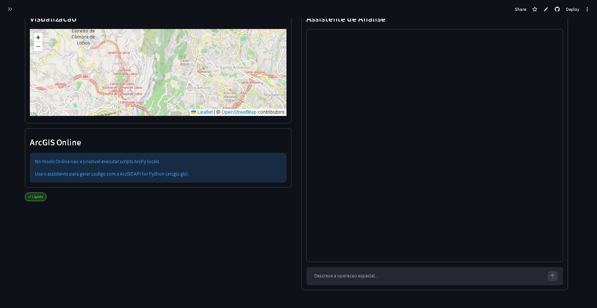

# GeoAI — Assistente de Geoprocessamento com IA


> Aplicação web que combina **ArcGIS** com **Inteligência Artificial** (Groq / LLaMA) para gerar, validar e executar scripts de geoprocessamento através de linguagem natural.

---

## Screenshot



---

## Funcionalidades

- **Chat com IA** — descreve em português o que queres fazer e o assistente gera o código ArcPy automaticamente
- **Mapa interativo** — visualização Folium integrada centrada na Madeira
- **Suporte multi-versão ArcGIS**:
- ArcGIS Online (via API)
- ArcGIS Pro (arcpy.mp)
- ArcMap Desktop 10.2 a 10.8 (arcpy.mapping)
- **Segurança**: validação de scripts, whitelist de imports, rate limiting, timeout de sessão
- **Editor de scripts** com execução direta e visualização de output
- **Deteção automática de ficheiros .mxd**
- **Painel de logs** em tempo real

---

## Instalação

### 1. Clonar o repositório

```bash
git clone https://github.com/yrozxm/geoia.git
cd geoia
```

### 2. Instalar dependências

```bash
pip install -r requirements.txt
```

### 3. Configurar variáveis de ambiente

Cria um ficheiro `.env` na raiz do projeto:

```env
GROQ_API_KEY=a_tua_api_key_aqui
AGOL_URL=https://www.arcgis.com

# Opcional — caminho personalizado para Python ArcGIS Desktop
# ARCGIS_DESKTOP_PYTHON=C:/Python27/ArcGIS10.8/python.exe

# Opcional — caminho personalizado para Python ArcGIS Pro
# ARCGIS_PRO_PYTHON=C:/Program Files/ArcGIS/Pro/bin/Python/envs/arcgispro-py3/python.exe

# Opcional — timeout de execução de scripts (segundos)
# SCRIPT_TIMEOUT=60
```

> Podes obter a tua Groq API Key em [console.groq.com](https://console.groq.com)

### 4. Executar a aplicação

```bash
streamlit run IA_esri.py
```

---

## requirements.txt

```
streamlit
groq
folium
streamlit-folium
python-dotenv
arcgis
```

---

## Estrutura do Projeto

```
geoia/
├── IA_esri.py          # Aplicação principal
├── .env                # Variáveis de ambiente (não commitar!)
├── .env.example        # Exemplo de configuração
├── requirements.txt    # Dependências Python
└── README.md
```

---

## Segurança

O GeoAI inclui várias camadas de proteção para execução segura de scripts:

| Proteção | Descrição |
|---|---|
| **Whitelist de imports** | Apenas `arcpy`, `json`, `math`, `datetime`, `numpy`, `pandas`, etc. |
| **Padrões bloqueados** | `os.system`, `subprocess`, `eval`, `exec`, `socket`, etc. |
| **Tamanho máximo** | Scripts limitados a 50KB |
| **Timeout** | Execução cancelada após 60s (configurável) |
| **Rate limiting** | 20 pedidos por 60 segundos |
| **Timeout de sessão** | Sessão expira ao fim de 60 minutos |

---

## Modos de Ligação

### ArcGIS Online
Requer utilizador e password de uma conta ArcGIS Online. Permite listar WebMaps e Feature Layers. Não suporta execução de scripts ArcPy locais.

### ArcGIS Pro
Deteta automaticamente o Python do ArcGIS Pro em:
`C:\Program Files\ArcGIS\Pro\bin\Python\envs\arcgispro-py3\python.exe`

### ArcMap Desktop (10.2 – 10.8)
Deteta automaticamente instalações em `C:\Python27\ArcGIS*`. Requer a seleção de um ficheiro `.mxd` para execução de scripts. **Não é necessário ter o ArcMap aberto.**

---

## Configuração Avançada

| Variável | Default | Descrição |
|---|---|---|
| `GROQ_MODEL` | `llama-3.3-70b-versatile` | Modelo Groq a utilizar |
| `SCRIPT_TIMEOUT` | `60` | Timeout de execução (segundos) |
| `AGOL_URL` | `https://www.arcgis.com` | URL do ArcGIS Online |
| `ARCGIS_PRO_PYTHON` | *(caminho padrão)* | Python do ArcGIS Pro |
| `ARCGIS_DESKTOP_PYTHON` | *(deteção automática)* | Python do ArcMap Desktop |

---

## Deploy no Streamlit Cloud

1. Faz fork ou push do repositório para o GitHub
2. Vai a [share.streamlit.io](https://share.streamlit.io) e liga o repositório
3. Em **"Advanced settings"** → **"Secrets"**, adiciona as variáveis do `.env`:

```toml
GROQ_API_KEY = "a_tua_key"
AGOL_URL = "https://www.arcgis.com"
```

> No Streamlit Cloud não é possível usar ArcGIS Pro nem ArcMap Desktop (sem instalação local). Apenas o modo **ArcGIS Online** funciona na cloud.

---

## Autor

Desenvolvido por **Mateus Jesus** — [github.com/yrozxm](https://github.com/yrozxm)

DIG — Divisão de Informação Geográfica

---

## Licença

Este projeto está licenciado sob a [MIT License](LICENSE).
